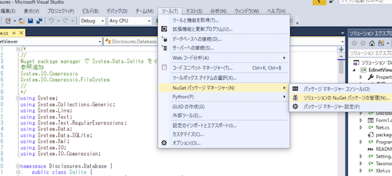
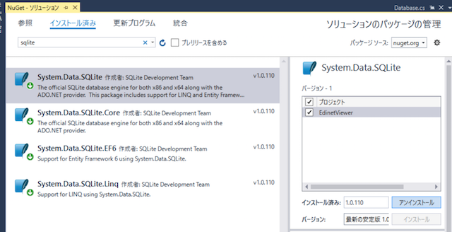
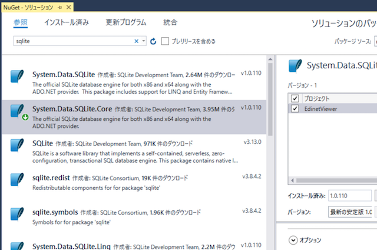
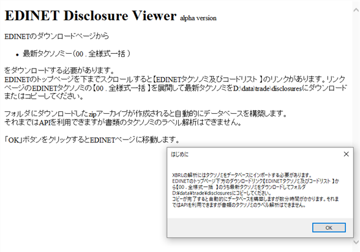
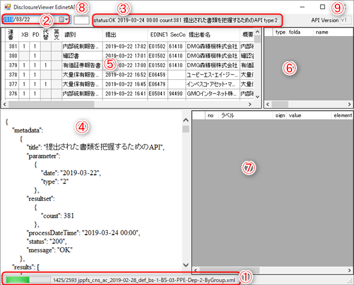
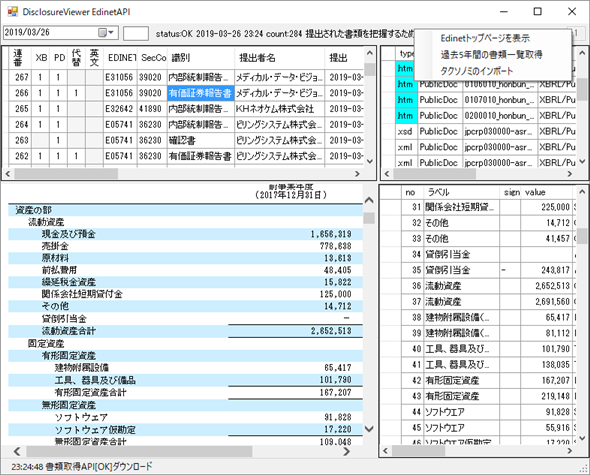
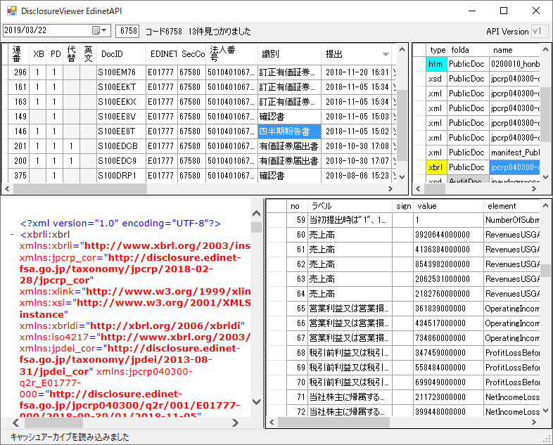
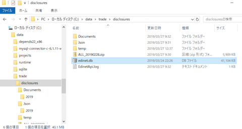

# EdinetViewer

WebAPIを利用してEdinetの開示書類を閲覧するだけのC#アプリ。  
VisualStudio2017でビルド可能です。

## Description
1. EdinetのWebAPIを介して、指定した日付の開示書類リストをJSONレスポンスで取得。
2. JSON生データはWebBrowserに出力、リストはテーブル表示。
3. リスト選択してxbrlを含んでいればzipアーカイブをダウンロードして内部ファイルリスト一覧をテーブル表示。
4. 内部ファイルリストからファイルを選択すると内容をWebBrowserで表示。
5. このファイルがxbrlまたはインラインxbrlであれば、抽出エレメントをタクソノミと照合しラベル変換して一覧表示。
6. 過去の日付の書類一覧をバックグラウンドでダウンロードできる。
7. 書類一覧リストはSqlite3データベースに保存するため、コードを指定して銘柄の開示書類一覧をテーブル表示可能。
8. XBRLに関しては選択書類の閲覧だけで、売上等を時系列で比較するなどの機能はなし（これをもとに拡張可能と考える）。

## 準備
### Sqliteの導入
このプロジェクトはSqliteライブラリが必要ですが、同包していませんのでこれだけではビルドできません。  
Sqliteはライセンス「Public Domain」で利用できるライブラリで、Nugetパッケージ管理からインストールできます。  

1. Nugetパッケージ管理を表示
- 「ツール」「NuGetパッケージマネージャー」「ソリューションのNuGetパッケージの管理」 
  
2. インストール済でsqliteと入力して検索
- Sqliteの抜き忘れがあると以下のようにインストール済に項目が出てくる場合があります。  
- 表示される場合は一度これらをアンインストールしてください。  
    
3. インストール済にsqliteが表示されなければ、「参照」をクリックして「System.Data.Sqlite.Core」を選択してインストール
    
「System.Data.Sqlite」をインストールしてもいいですが、利用しているライブラリは「Core」だけでこれ以外は必要なさそうです。

### 初回起動
1. ダウンロードした書類を保存するキャッシュフォルダを選択するダイアログが出現 
- 任意のフォルダを選択してください

2. タクソノミのダウンロードを促すメッセージボックスが出現します。
  
- OKボタンを押すとブラウザがEDINETトップページを表示します。
- ダウンロードページから最新のタクソノミ（EDINETタクソノミ - 最新 - 00 . 全様式一括）をzipファイルとしてダウンロードしてキャッシュフォルダにコピーしてください。  
- 1.に関しては、初回起動時にフォルダダイアログが表示されて選択することで設定ファイルに保存される。  
- 2.に関しても、初回起動のブラウザからタクソノミのリンクをたどり1.のフォルダに保存するとフォルダ監視により自動的にタクソノミを解析してデーターベースに追加される。
  
-- タクソノミのデータベース構築には時間がかかるためバックグラウンドで実行するようにしています。
-- プログレスバーが動いている間も、日付を選択してAPIリクエストが可能です。

## フォームの説明と使い方
1. ステータスバー　この画面ではタクソノミのダウンロード後にデータベースを構築している途中  
2. 日付を選択するDateTimePicker 選択した日付の書類一覧リストをAPIリクエスト  
- 丸一日以上経過して確定したキャッシュがある場合はAPIを投げずにこれを読み込む  
- 当日分もクリックすることで取得する（当日分は0時を過ぎてprocessDateTimeが翌日に確定するまではクリックするごとにAPIリクエスト）
3. リクエストに対するレスポンスを要約して表示  
4. レスポンスを受け取るとその時点でブラウザに表示  
- リクエストはタイプ2
5. レスポンスのResult書類一覧をsubmitDateTime逆順でテーブル表示  
6. ５の任意のセルをクリックするとその行の書類取得APIリクエストを投げる  
- xbrlFlag = "1" の場合はXbrlをzipアーカイブでダウンロード  
- pdfFlag = "1" の場合はPDFをダウンロードしてブラウザに表示  
- 代替書面・添付文書、英文ファイルに関しては未実装  
- Xbrlをダウンロードするとアーカイブを読み込み⑥のテーブルに一覧表示  
7. ⑥に表示された任意のセルをクリックするとXbrlとインラインXbrlに関しては⑦にエレメント一覧を出力  
- 同時に④のブラウザにも出力  
- Xbrl以外も④に表示されるが、xmlの一部は表示されないことがある（右クリックからソースを開いて確認可能）  
8. ４桁銘柄コードを入力してデーターベースに銘柄があれば提出日の逆順で一覧表示  
- 過去の書類一覧を取得していなければヒットしない  
9. 将来APIバージョンが変わった場合ラベルをダブルクリックすることでテキストボックス編集が可能  
- バージョン情報はディレクトリ情報とともに、ビルド先のフォルダにマシン名のxmlファイルで保存  

右クリックメニュー    

Edinetトップページの表示、バックグラウンドで過去の書類一覧リストの取得などが可能。  

  

## 注記

1. xmlファイルによってはWebBrowserで内容が表示されないものがありますが、この場合は右クリックから「ソースの表示」で確認してください。
2. ツールバー右クリックメニューの「過去5年間の書類一覧取得」はバックグラウンドスレッドで実行します。  
- ダウンロード実行中に日付を選択して保存済みリストの表示なければ新たにリクエストを投げます。  
- また、リストを選択することでxbrlの書類もダウンロードします。  
- 十分に検証していませんがHttpClientが同時に別のリクエストを投げることでエラーを起こす場合があるかもしれません。  
- 短時間の大量アクセスは禁止事項に挙げられています。
- これに抵触する可能性も考えられるため過去データの自動収集はウェイトを多めにとっています。  
3. タクソノミについては構造とルールを理解しているわけではありません。  
- 独自の解釈で間違っている可能性もあり、Xmlエレメントとの照合が正しいとは限りません。

### 作成するディレクトリ、ファイルなど
1. ビルド先にResourcesフォルダを作成してFormCodes.txtをコピー 
- 様式コード（formCode）の一覧表  
- 別紙1様式コードリストのエクセルファイルをcsv形式のテキストファイルにしたもの
- 「EDINET API関連資料」 - 「EDINET API仕様書」 - 「別紙1_様式コードリスト.xlsx」
2. ビルド先にEdinetViewer_(マシン名).xmlの設定ファイルを作成  
- DocumentDirectoryタグで書類等をダウンロードするキャッシュルートディレクトリを記録
- versionタグでEDINET WebAPIのバージョンを記録
3. キャッシュディレクトリの構造
    1. Documentsフォルダ
    - ４桁年のサブフォルダを作成してこの中に書類ファイル（zipとpdf）がダウンロードされる
    2. Jsonフォルダ
    - ４桁年のサブフォルダを作成してyyyyMMdd.json形式のutf8テキストファイルで日付ごとの書類一覧レスポンス（タイプ2）を保存  
    - processDateTimeがparameterのdateの翌日以降になるまでの間はレスポンスを受け取ると上書き保存
    3. ALL_20190228.zip  ダウンロードしたタクソノミファイル
    4. edinet.db自動的に作成されるsqlite3のデータベースファイル
    5. EdinetApi.log  リクエストごとに投げたAPIリクエストを記録したログファイル  エラー確認用
    6. HttpClientError.log  HttpClientのStatusCodeがOK以外の場合に作成され追記されるエラーログ（エラーがなければ作成されない)
    7. tempフォルダ  XBRLアーカイブ内のイメージファイルを閲覧した場合作成される

### 作成されるデータベーステーブル
1. Disclosures
- タイプ2の書類一覧レスポンスのResultを保存
2. FormCodes
- 様式一覧のコード
3. Metadata
- 書類一覧レスポンスのmetadataを日付ごとに保存
4. Taxonomy
- ダウンロードしたタクソノミのxmlファイルから作成したラベル情報テーブル
5. sqlite_sequence
- sqliteがautoincrementコラム用に自動作成したテーブル

sqliteデーターベースをGUIで確認編集できる[DB Browser for SQLite](https://sqlitebrowser.org)が便利です。

